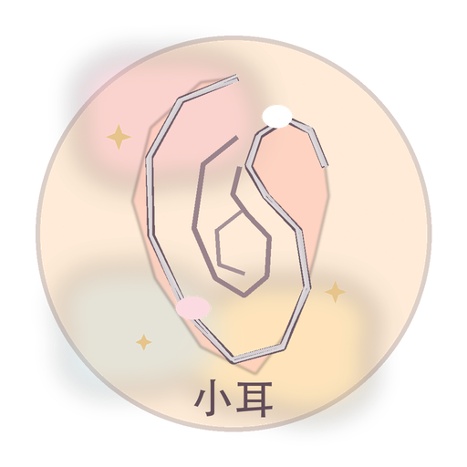
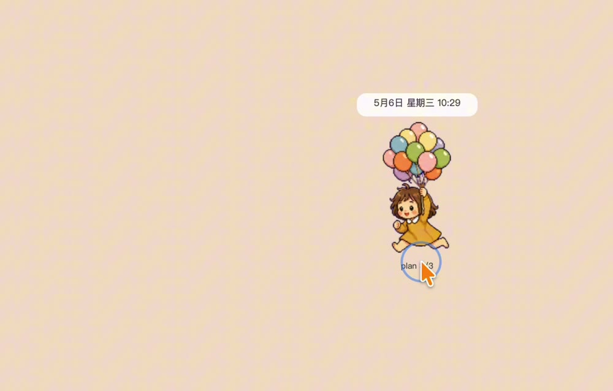

# Xiaoer Hammerspoon Pet

**English** | [中文](README.zh-CN.md)

<p align="center">
  
</p>

A watercolor desktop pet for macOS, powered by Hammerspoon. This repo packages my current running desktop companion: a small animated girl with pomodoro focus mode, todos, meal reminders, water reminders, sleep reminders, drag-to-run movement, and todo-completion celebration.

## Demo Video

[](https://github.com/Jane-xiaoer/xiaoer-hammerspoon-pet/releases/download/v0.1.3/xiaoer-anti-addiction-desktop-pet-demo.mp4)

Watch the desktop pet in action: [Xiaoer anti-distraction desktop pet demo](https://github.com/Jane-xiaoer/xiaoer-hammerspoon-pet/releases/download/v0.1.3/xiaoer-anti-addiction-desktop-pet-demo.mp4).

## Features

- Always-on desktop companion that can be dragged anywhere on screen.
- `Control + Option + P` opens a translucent watercolor control panel.
- 45-minute pomodoro: plays `working` while focusing, then jumps to the screen center with `failed` until dismissed.
- Daily meal reminders at `12:30` and `18:00`, playing `eating`.
- Daily sleep reminder at `22:30`, playing `sleeping`.
- Hourly water reminder, playing `drinking`.
- Custom reminders automatically map to meal, water, or sleep animations when the text contains matching keywords.
- Completing all todos for the day plays `jumping` as a celebration.
- Dragging the pet plays `running-right` or `running-left` based on mouse direction.

## Animation Mapping

| Scenario | mood / state | Animation folder |
|---|---|---|
| Daily idle loop | `idle` | `idle`, `review`, `waving`, `running`, `rowing`, `yoga`, `waiting` |
| Focus work | `focus` | `working` |
| Complete a normal todo | `break` | `waving` |
| Complete all todos today | `jumping` | `jumping` |
| Meal reminder | `hungry` | `eating` |
| Water reminder | `thirsty` | `drinking` |
| Sleep reminder | `sleepy` | `sleeping` |
| Pomodoro break reminder | `failed` | `failed` |
| Drag right | drag override | `running-right` |
| Drag left | drag override | `running-left` |

## Install

### Friendly Install

1. Install [Hammerspoon](https://www.hammerspoon.org/).
2. Download `XiaoerPet.dmg` from this repo's [Releases](https://github.com/Jane-xiaoer/xiaoer-hammerspoon-pet/releases).
3. Open the DMG.
4. Double-click:

```text
Install Xiaoer Pet.command
```

The installer copies the pet into `~/.hammerspoon/pai`, creates a local config if needed, asks what the pet should call you, and opens or reloads Hammerspoon. That name appears in the panel title and the drag encouragement text.

If you prefer the ZIP route, click **Code → Download ZIP**, unzip it, then double-click the same `Install Xiaoer Pet.command`.

The repo includes a cute Xiaoer ear icon at:

```text
assets/xiaoer-ear-install-icon.png
assets/xiaoer-ear-install-icon.icns
```

The `.command` installer also tries to apply this icon to itself the first time it runs. GitHub ZIP downloads do not always preserve Finder custom icons before first launch, so the source icon files are included too.

### DMG Build

To build a shareable DMG locally:

```bash
chmod +x scripts/build-dmg.sh
./scripts/build-dmg.sh
```

The DMG will be written to:

```text
dist/XiaoerPet.dmg
```

The DMG includes:

```text
Install Xiaoer Pet.command
Switch Pet.command
pets/xiaoer/
pets/_template/
README.md
README.zh-CN.md
```

### Terminal Install

1. Install [Hammerspoon](https://www.hammerspoon.org/).
2. Clone this repo:

```bash
git clone https://github.com/Jane-xiaoer/xiaoer-hammerspoon-pet.git
cd xiaoer-hammerspoon-pet
chmod +x scripts/install.sh
./scripts/install.sh
```

3. If you already have `~/.hammerspoon/init.lua`, make sure it contains:

```lua
require("pai").start()
```

4. Restart Hammerspoon.

## Make Your Own Character

Animation frames live here:

```text
pai/assets/companion/balloons/
```

Each state is a folder of ordered PNG frames:

```text
idle/00.png
idle/01.png
...
working/00.png
working/01.png
...
```

To customize:

1. Download or generate a pet character from one of the pet sources below.
2. Split each action into sequential PNG frames.
3. Drop the frames into the matching state folder using names like `00.png`, `01.png`, `02.png`.
4. Restart Hammerspoon.

Pet sources:

- [codexpet.xyz](https://codexpet.xyz/)
- [codex-pets.net](https://codex-pets.net/)
- [gitpets.com](https://gitpets.com/)

## Switch Pets

After installing, double-click:

```text
Switch Pet.command
```

Choose a pet folder. The switcher copies that folder into:

```text
~/.hammerspoon/pai/pets/
```

Then it updates:

```text
~/.hammerspoon/pai/local_config.json
```

so `companion_animation_root` points to the selected pet.

This means a DMG does **not** limit customization. The DMG is only the delivery package; your actual pet files live in `~/.hammerspoon/pai/pets/` after installation.

For a custom pet, copy `pets/_template`, rename it, fill each state folder with PNG frames, then use `Switch Pet.command` to select it.

## Suggested State Folders

| Folder | Suggested motion |
|---|---|
| `idle` | standing, blinking, soft breathing |
| `review` | reading, thinking, checking |
| `waving` | waving, happy |
| `waiting` | waiting, daydreaming |
| `running` | casual running for the idle loop |
| `rowing` | rowing-machine workout for the idle loop |
| `yoga` | yoga-ball stretch for the idle loop |
| `running-right` | running right while dragged |
| `running-left` | running left while dragged |
| `working` | focused work, typing |
| `eating` | meal reminder, ringing a bell |
| `drinking` | water reminder, lifting a cup |
| `sleeping` | sleep reminder, yawning |
| `failed` | pomodoro ended, rest reminder |
| `jumping` | celebration after all todos are done |

## Configuration

The install script creates:

```text
~/.hammerspoon/pai/local_config.json
```

Use it to change size, reminder times, and animation mappings. The template is:

```text
pai/local_config.example.json
```

Common settings:

```json
{
  "companion_width": 210,
  "companion_height": 288,
  "companion_panel_width": 299,
  "companion_panel_height": 469,
  "companion_idle_animation_cycle_seconds": 600
}
```

## Notes

- This repo does not include personal API keys, voice-agent settings, or local runtime state.
- Do not commit `local_config.json` or `companion_state.json`.
- This is a Hammerspoon Lua setup, not a standalone macOS app.

## License

[MIT](LICENSE)

---

## Follow Me

If this repo helped you, follow me for more AI skills, desktop automation, Hammerspoon tools, creative coding, and personal productivity experiments.

- X (Twitter): [@xiaoerzhan](https://x.com/xiaoerzhan)
- WeChat Official Account: Scan to follow

<p align="center">
  
</p>

<p align="center"><strong>English:</strong> Follow my WeChat Official Account for more AI skills, desktop automation, Hammerspoon tools, and creative experiments.</p>

<p align="center"><strong>中文：</strong>欢迎关注我的公众号，一起研究 AI Skill、桌面自动化、Hammerspoon 工具和创意实验。</p>
